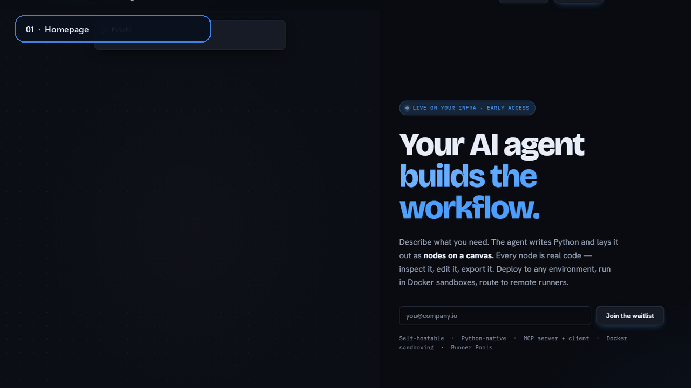

# Nodyra

<p align="center">
  
</p>

**Self-hosted, Python-native workflow automation with a visual editor and an
MCP interface for AI-assisted building.**

> Nodyra is in public beta. It is suitable for evaluation and trusted-team
> deployments, but it does not yet have an LTS release or a hosted Nodyra
> service. The project was previously developed under the name **Noodle**.

Nodyra turns Python functions into inspectable workflow nodes. Build on a
canvas or through an MCP client, run each workflow in a selected Python
environment, inspect node inputs and outputs, and publish immutable versions
for scheduled, webhook, or API-driven execution.

## Why Nodyra

- **Python is the runtime, not a wrapper.** Use pandas, boto3, database drivers,
  internal packages, and ordinary Python functions directly in nodes.
- **AI-built workflows stay visible.** MCP clients can create and edit the same
  graphs that people inspect, test, and publish in the UI.
- **Execution is debuggable.** Each node exposes inputs, outputs, logs, timing,
  errors, artifacts, and lineage.
- **Production changes are explicit.** Drafts are editable; deployments run
  pinned, published workflow versions.
- **It is self-hosted.** The stack is FastAPI, React/Vite, PostgreSQL, Redis,
  object storage, and separate execution workers.

## Quick start

Start with the [1.0.5 self-hosted beta release](https://github.com/Harshit-repo/Nodyra/releases/tag/v1.0.5)
and the [single-host installation guide](docs/deployment/self-hosted.md).
This release supplies source archives and checksums; Docker builds the images
locally. Signed prebuilt 1.0.5 images are not included.

You need Docker Engine or Docker Desktop with Docker Compose **2.24.4+**.
To use the verified release from Git:

```bash
git clone --branch v1.0.5 --depth 1 https://github.com/Harshit-repo/Nodyra.git
cd Nodyra
cp deploy/.env.example deploy/.env
```

Open `deploy/.env` and replace the three active `CHANGE-ME` values with separate
random values (`openssl rand -hex 32` for each). Set a strong
`POSTGRES_PASSWORD` too. Keep the MinIO password configured even though this
local-storage profile does not start MinIO: Compose validates the base file.

For loopback-only HTTP evaluation, set `SESSION_COOKIE_SECURE=false` and
`CORS_ORIGINS=http://localhost:5173`. Use secure cookies and the HTTPS settings
in the installation guide before allowing access from other machines.

```bash
docker compose -p nodyra -f deploy/docker-compose.yml \
  -f deploy/docker-compose.local-storage.yml up --build -d --wait
```

Open <http://localhost:5173>. The first registered account becomes the owner;
registration then closes unless you explicitly enable it.

Verify the API:

```bash
curl http://localhost:8000/health/live
curl http://localhost:8000/health/ready
```

For a credential-free first run, create a workflow from the **Dataset filter
and CSV export** template. The complete walkthrough is in
[Getting started](docs/getting-started.md).

For a persistent single-host installation without MinIO or a cloud bucket, use
the [trusted-team self-hosting profile](docs/deployment/self-hosted.md). It also
covers HTTPS, automatic service restarts, storage, and backups.

## Documentation and product tour



- [Documentation index](docs/README.md): installation, workflow authoring, MCP,
  workers, security, and operations.
- [Release verification](docs/releases/1.0.5.md): tested scope and distribution
  limits, with links to the published evidence.
- [Product tour](docs/nodyra-product-tour.gif): homepage, workflow execution,
  node inspector, and Python editor.
- [Documentation website](docs/documentation-site.md): build and publish the
  product landing page and its linked documentation.

## Build workflows with an AI agent

Nodyra includes an MCP server. For example, connect Claude Code to a running
instance:

```bash
claude mcp add --transport http nodyra https://your-instance.example/mcp \
  --header "Authorization: Bearer <api-token>"
```

You can then ask the client to create, validate, run, and publish workflows.
The resulting graph remains editable in Nodyra. See the
[MCP quickstart](docs/mcp-quickstart.md) for authentication and other clients.

## Write a Python node

Nodes are ordinary decorated functions:

```python
from nodyra.sdk import node


@node(name="Normalize Customer", id="normalize_customer", category="Data")
def normalize_customer(input: dict, lowercase_email: bool = True) -> dict:
    customer = dict(input)
    if lowercase_email and customer.get("email"):
        customer["email"] = customer["email"].lower()
    return customer
```

Upload the module and the function appears in the node palette. Discovery uses
the Python AST; uploaded source is not executed merely to generate the preview.
See [Writing nodes](docs/nodes.md) for ports, credentials, artifacts, and tests.

## What is included

- Visual workflow editor with typed configuration and expression fields.
- Manual, schedule, webhook, deployment, and error-workflow triggers.
- Topological execution, branching, retries, timeouts, sub-workflows, and
  retry-from-failed-node.
- Per-environment Python virtual environments and warm subprocess workers.
- Durable run queue, leases, dead-letter handling, worker heartbeats, and
  graceful drain.
- Local authentication, role-based access control, encrypted credentials,
  audit events, and configurable retention limits.
- Typed serialization plus artifact-backed datasets and DuckDB transformations.
- Built-in nodes for data, files, HTTP, databases, messaging, cloud services,
  and AI providers.
- Workflow import/export, GitOps sync, a CLI/Python client, and MCP tools.

The [status matrix](docs/status-matrix.md) distinguishes shipped, beta,
experimental, and planned areas.

## Architecture

```text
React web app
    |
    | HTTP / WebSocket / MCP
    v
FastAPI control plane ---- PostgreSQL
    |
    | durable queue
    v
Dispatch workers -------- Redis
    |
    | per-environment subprocess or sandbox
    v
Nodyra engine + Python nodes ---- artifact storage
```

The control plane validates and stores workflows, resolves credentials,
persists runs, and streams events. Workers execute the graph in the selected
environment. See [Architecture](docs/architecture.md) for the full model and
[Architecture chooser](docs/architecture-chooser.md) for deployment options.

## Security boundary

Nodyra workflows can execute arbitrary Python. The Compose default
`EXECUTION_SANDBOX=auto` can fall back to subprocess execution when a container
runtime is unavailable. Workflow authors must therefore be trusted to run code
on the worker host.

For untrusted code, configure `EXECUTION_SANDBOX=required` with the documented
sandbox runtime and verify that it is healthy. Multi-tenant mode requires the sandbox
and refuses to start without it. Authentication and startup checks fail closed
for unsafe secret or topology combinations.

Read [SECURITY.md](SECURITY.md) before exposing an instance to a network.

## Local development

Requirements: Python 3.12, [uv](https://docs.astral.sh/uv/), Node.js 20+, and
Docker for the supporting services.

```bash
uv sync --all-packages
docker compose -f deploy/docker-compose.yml up postgres redis minio
uv run alembic -c apps/api/alembic.ini upgrade head
uv run uvicorn app.main:app --app-dir apps/api --reload --port 8000
```

In another terminal:

```bash
cd apps/web
npm install
npm run dev
```

Run the main checks:

```bash
uv run ruff check .
uv run pytest
cd apps/web
npm run typecheck
npm test
npm run build
```

## Repository layout

```text
apps/api/          FastAPI control plane, migrations, and dispatch worker
apps/web/          React, Vite, and React Flow application
packages/core/     workflow engine, SDK, models, and serialization
packages/nodes/    built-in and provider nodes
packages/runtime/  per-environment execution runtime
packages/client/   typed Python client and nodyra CLI
packages/exporter/ workflow export tooling
packages/importer/ migration and compatibility tooling
deploy/            Compose, Helm, and observability configuration
docs/              user, developer, security, and operations guides
```

The client package is currently installed from a source checkout; it has not
yet been released on PyPI. See [CLI and Python client](packages/client/README.md).

## Documentation

- [Documentation index](docs/README.md)
- [Getting started](docs/getting-started.md)
- [Deployment](docs/deployment.md) and [operations runbooks](docs/operations/README.md)
- [Architecture](docs/architecture.md)
- [Nodes and the Python SDK](docs/nodes.md)
- [Integration development](docs/integration-development.md)
- [Migration](docs/migration.md)
- [Licensing guide](docs/licensing.md)
- [Changelog](CHANGELOG.md)

## Contributing and security

Bug reports and focused pull requests are welcome. Read
[CONTRIBUTING.md](CONTRIBUTING.md), the
[Code of Conduct](CODE_OF_CONDUCT.md), and the
[Contributor License Agreement](CONTRIBUTOR_LICENSE_AGREEMENT.md) before
contributing.

Please report vulnerabilities privately as described in
[SECURITY.md](SECURITY.md), not in a public issue.

## License

Nodyra is **source-available fair-code**, not OSI open source.

- The core is distributed under the
  [Nodyra Sustainable Use License](LICENSE). Internal business and personal
  self-hosting are permitted; offering Nodyra to third parties as a hosted or
  managed service requires a commercial agreement.
- Enterprise-gated features are covered by the
  [Nodyra Enterprise License](LICENSE.enterprise).
- The name and logo are covered by the [Trademark policy](TRADEMARK.md).

The [plain-English licensing guide](docs/licensing.md) summarizes common use
cases. The license files remain the binding terms.
